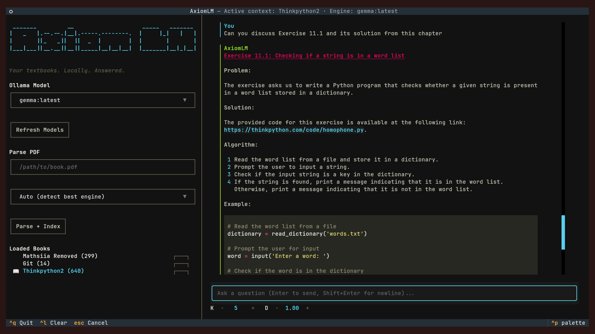
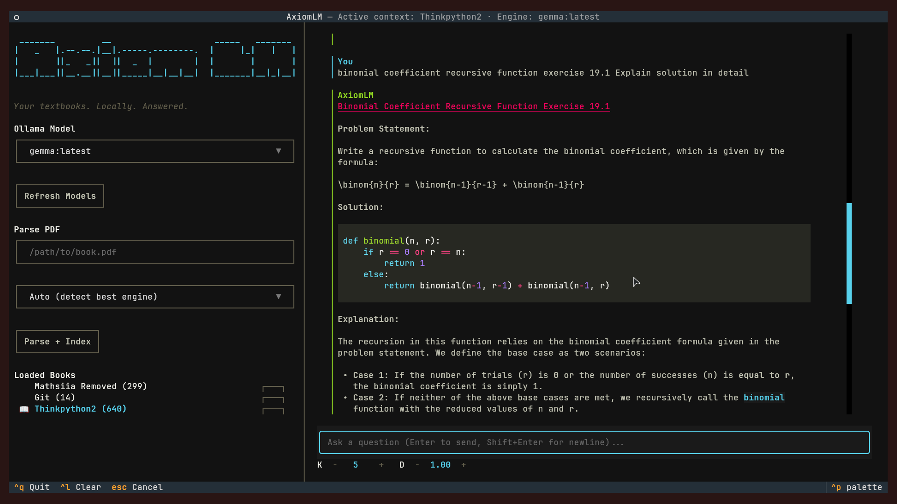
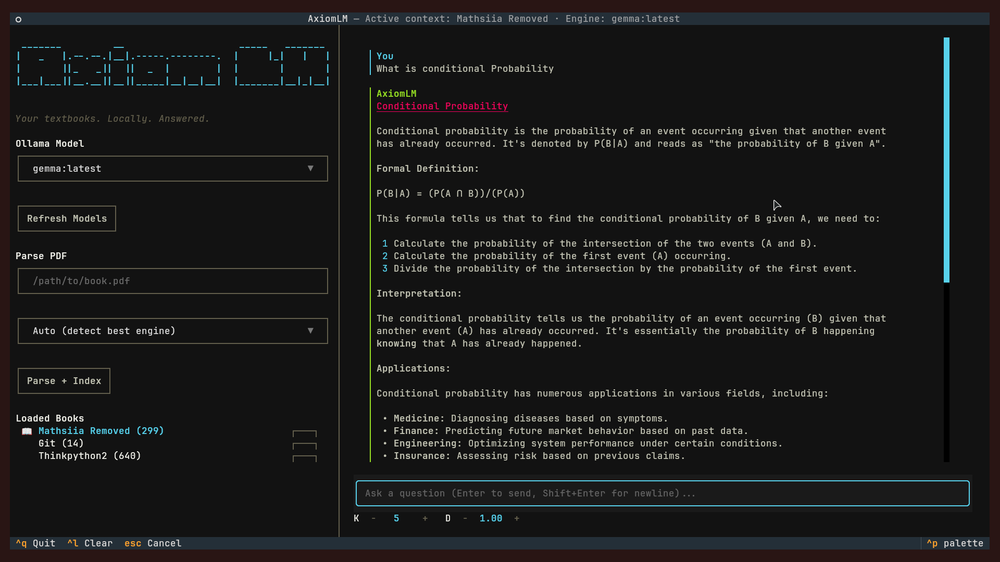

<div align="center">


 _______         __                    _____   _______ 
|   _   |.--.--.|__|.-----.--------.  |     |_|   |   |
|       ||_   _||  ||  _  |        |  |       |       |
|___|___||__.__||__||_____|__|__|__|  |_______|__|_|__|

### Your Textbooks. Locally. Answered.

**A fully local, privacy-first RAG study assistant that lives in your terminal.**  
Parse your PDFs. Ask anything. Get cited answers. No cloud. No subscriptions. No limits.


</div>

---

## Table of Contents

- [What is AxiomLM?](#what-is-axiomlm)
- [Screenshots](#screenshots)
- [Features](#features)
- [Models Used](#models-used)
- [Tech Stack](#tech-stack)
- [Project Structure](#project-structure)
- [Installation](#installation)
- [Documentation](#documentation)
  - [Parsing PDFs](#parsing-pdfs)
  - [How the Engines Work](#how-the-engines-work)
  - [Tuning K and D Values](#tuning-k-and-d-values)
  - [Why Scanned PDFs Take Longer](#why-scanned-pdfs-take-longer)
- [Roadmap](#roadmap)
- [Contributing](#contributing)
- [License](#license)

---

## What is AxiomLM?

Most students have a pile of PDFs they never actually use. Textbooks, lecture notes, past papers — they open them, ctrl+F something, get lost, and give up.

The obvious solution is to ask an AI. But try pasting your 300-page scanned Engineering Mathematics textbook into ChatGPT. It won't read it. Gemini has a context window, but feed it a full textbook and it starts hallucinating, losing content from earlier chapters, and forgetting what you asked three questions ago. These tools were built for conversations, not for deeply understanding a specific 500-page document you care about.

NotebookLM comes closest — it's designed for exactly this — but it has strict upload limits, it can't handle large scanned PDFs the way they need to be handled, and everything you upload goes to Google's servers. Your exam papers, your university notes, your course content — all of it sitting on someone else's infrastructure.

AxiomLM is the alternative that doesn't make those compromises.

It's a terminal application. You point it at a PDF, it parses and indexes the content locally using a vector database, and then you chat with it using any model running through Ollama. Every answer comes with a citation showing exactly which book, chapter, and page it came from. There are no upload limits because nothing is being uploaded. There are no context window tricks because the content is indexed and retrieved semantically. A 585-page scanned textbook is as accessible as a 50-page clean PDF — it just takes longer to process the first time.

The parsing is smart enough to tell the difference between a clean digital PDF like a programming textbook and a scanned physical book photographed with a camera. It routes each one to the right engine automatically. A 240-page clean Python textbook parses in under 10 seconds. A 585-page scanned engineering mathematics textbook with dense probability and calculus notation takes around 30-40 minutes, but it works — equations, fractions, Bayes' theorem notation and all — and once indexed it answers instantly.

It works offline. It works over SSH. It works on a train with no internet. It runs entirely on your machine.

This isn't a demo or a proof of concept. It's a study tool built by a student, for students, that actually answers questions from the books it's given.

---

## Screenshots




---

## Features

**Core**
- Fully local RAG pipeline — no data ever leaves your machine
- Smart PDF routing — automatically detects clean vs scanned PDFs and picks the right parser
- Conversation memory — follow-up questions like "give me an example of this" work correctly
- Cited answers — every response shows the source book, chapter, and page number
- Multi-book support — index multiple books and switch between them in the same session
- Checkpoint/resume system — long parses resume from where they left off if interrupted
- GPU acceleration — uses your NVIDIA GPU for faster parsing when available

**Interface**
- Terminal-native TUI built with Textual
- ASCII logo with cyan color scheme
- Live parsing progress with ETA and chunk stats
- Token speed and response time displayed per answer
- Copy and Code buttons on every response
- Keyboard-driven — `^q` quit, `^l` clear, `^d` delete book

**Parsing Engines**
- `pymupdf4llm` — instant parsing for clean digital PDFs
- `MinerU` — GPU-accelerated OCR for scanned and complex PDFs, with batched processing to prevent VRAM exhaustion
- `Marker` — available as a manual option for clean math-heavy PDFs (requires 8GB+ VRAM)

---

## Models Used

| Role | Model | Purpose |
|---|---|---|
| **LLM** | Any Ollama model (default: `gemma:latest`) | Answering questions, reasoning over context |
| **Embeddings** | `jina-embeddings-v2-base-en` | Semantic search over indexed chunks |
| **OCR (scanned PDFs)** | MinerU `hybrid-auto-engine` | Extracting text from photographed/scanned pages |

AxiomLM is model-agnostic for the LLM layer. If Ollama can run it, AxiomLM can use it. Switch between Gemma, Llama 3, Mistral, Qwen, or anything else from the model dropdown without restarting.

---

## Tech Stack

| Layer | Technology |
|---|---|
| **TUI Framework** | Textual |
| **LLM Runtime** | Ollama |
| **Vector Database** | ChromaDB (persistent, local) |
| **Embeddings** | Sentence Transformers + Jina v2 |
| **PDF Parsing (clean)** | pymupdf4llm |
| **PDF Parsing (scanned)** | MinerU |
| **PDF Parsing (math)** | Marker (manual, GPU-heavy) |
| **GPU Acceleration** | PyTorch + CUDA |
| **Language** | Python 3.11+ |

---

## Project Structure

```
AxiomLM/
├── src/
│   ├── tui.py           # Main TUI application — all UI logic, RAG pipeline, chat handler
│   ├── ocr.py           # Unified OCR entry point — auto-routing between engines
│   ├── ocr_marker.py    # Marker runner for clean math PDFs
│   ├── ocr_mineru.py    # MinerU runner for scanned PDFs — batched, resumable
│   ├── ocr_pymupdf.py   # pymupdf4llm runner for clean digital PDFs
│   ├── indexer.py       # Chunking and indexing parsed markdown into ChromaDB
│   ├── db.py            # ChromaDB client, Jina embeddings, collection management
│   ├── checkpoint.py    # Per-page checkpoint system for resumable parsing
│   ├── preprocessor.py  # Text cleaning and normalization before indexing
│   ├── config.py        # All configuration constants and paths
│   └── __init__.py
├── scripts/             # Setup and validation scripts
├── data/                # Local data directory (gitignored)
│   ├── parsed_md/       # Per-book parsed markdown files
│   ├── checkpoints/     # Per-page parsing checkpoints
│   └── vector_store/    # ChromaDB persistent storage
├── pyproject.toml       # Package definition and entry point
├── requirements.txt     # Python dependencies
├── install.sh           # One-command installer
└── README.md
```

---

## Installation

### Requirements

- Linux (tested on Arch Linux)
- Python 3.11+
- [Ollama](https://ollama.ai) installed and running
- NVIDIA GPU recommended (RTX 3050 or better for scanned PDF parsing) //since its my gpu :P

### One-Command Install

```bash
curl -sSL https://raw.githubusercontent.com/JustJoyful/AxiomLM/main/install.sh | bash
```

This will clone the repo, create an isolated virtual environment, install all dependencies, and create the `axiomlm` command in your PATH.

### Manual Install

```bash
git clone https://github.com/JustJoyful/AxiomLM.git
cd AxiomLM
bash install.sh
```

### Pull a Model

After installing, pull a model through Ollama:

```bash
ollama pull gemma:latest
# or
ollama pull llama3
# or any other model you prefer
```

### Run

```bash
axiomlm
```

---

## Documentation

### Parsing PDFs

To use AxiomLM, you first need to parse and index your PDF. Enter the full path to your PDF in the **Parse PDF** field and click **Parse + Index**.

The app will automatically detect what kind of PDF it is and route it to the right engine. You can also manually select an engine from the dropdown if you know what you need.

Once parsing is complete, the book appears in the **Loaded Books** panel with a chunk count. Select it and start asking questions.

---

### How the Engines Work

AxiomLM uses three parsing engines, each designed for a different type of PDF.

**pymupdf4llm — Clean Digital PDFs**

This is the default engine for any well-structured digital PDF — programming textbooks, lecture notes, documentation, anything exported directly from a word processor or LaTeX. It extracts text directly from the PDF's internal structure without any OCR. For a 240-page book like Think Python, it completes in under 10 seconds. No GPU needed.

**MinerU — Scanned and Complex PDFs**

MinerU is used for PDFs that were physically scanned — a textbook photographed page by page, a past exam paper scanned from paper, or any document where the text exists as an image rather than selectable characters. It runs a full OCR pipeline using GPU acceleration.

Because scanned PDFs are much heavier to process, MinerU runs in batches of 24 pages at a time with a short rest between batches to prevent VRAM exhaustion. A 585-page scanned engineering mathematics textbook with dense probability and calculus notation takes around 30-40 minutes but processes reliably without crashing. The checkpoint system means if parsing is interrupted, it resumes from the last completed page rather than starting over.

**Marker — Clean Math-Heavy PDFs (Manual)**

Marker is available as a manual option for clean PDFs that contain heavy mathematical notation — things that pymupdf4llm might flatten or distort. It requires 8GB+ VRAM to run without OOM errors and is not used in auto-routing for this reason. Select it manually from the dropdown if you have the hardware for it.

---

### Tuning K and D Values

At the bottom of the chat panel you'll see:

```
K - 5 + D - 0.75 +
```

These control how the RAG retrieval works.

**K** is the number of chunks retrieved from the vector database for each question. A higher K means more context is passed to the model, which helps for broad questions like "explain everything about Bayes' theorem." A lower K keeps answers focused and faster. The default of 5 works well for most questions. Increase it to 8-10 if you feel answers are missing relevant content from the book.

**D** is the similarity threshold — how closely a chunk must match your question to be included. A lower D is more strict and only retrieves very relevant chunks. A higher D is more lenient and casts a wider net. If the model is saying it can't find information that you know is in the book, try increasing D slightly. If answers contain irrelevant content from other parts of the book, decrease it.

---

### Why Scanned PDFs Take Longer

When you scan a physical book, each page becomes an image. There's no underlying text — just pixels. To extract the content, MinerU runs a full computer vision pipeline: it detects page regions, classifies each block as text, image, table, or formula, runs OCR on text regions, and uses a dedicated math recognition model for equations.

This is significantly more compute-intensive than reading text from a clean PDF. The batch system exists specifically to prevent the GPU from running out of memory mid-parse. Each batch of 24 pages is processed, the VRAM is cleared, and the next batch begins. The checkpoint system saves progress after every page so you can safely interrupt and resume.

For most scanned textbooks under 100 pages, expect 5-10 minutes. For larger books (400+ pages), expect 30-60 minutes. Run it in the background and let it finish.

---

## Roadmap

### Voice I/O
The plan is a fully local voice pipeline using:
- `faster-whisper` (tiny.en model) for speech-to-text — CPU-bound, instant transcription via microphone
- `sounddevice` for raw audio capture
- `Piper TTS` for text-to-speech responses
- A custom Textual worker thread that reads audio amplitude and renders a `█ ▆ ▃` visualizer without blocking the UI

The entire pipeline runs locally with zero external API calls, consistent with AxiomLM's privacy-first design.

### UI Improvements
- Fix the ASCII logo rendering inconsistency across terminal emulators
- Denser sidebar layout with Unicode icons (requires Nerd Fonts)
- Subtle background pattern in the empty chat panel
- Proper LaTeX-to-Unicode post-processing for cleaner math rendering
- Remove horizontal scrollbar from code blocks

### Quality of Life
- `@book` mention syntax to query a specific book without switching context
- `/commands` for in-chat actions like `/clear`, `/books`, `/reindex`
- Session export — save a conversation as markdown
- Automatic model warm-up on launch to eliminate first-response cold start lag
- Per-book conversation history that persists across sessions
- MinerU batch size configuration in the UI

### Planned Engine Improvements
- Auto-detect math density and route clean math PDFs to Marker when VRAM permits
- pymupdf4llm fallback if MinerU fails on a batch rather than hard error
- Progress estimation for MinerU parses based on page complexity sampling

---

## Contributing

AxiomLM is actively developed. Contributions are welcome.

```bash
# Fork and clone
git clone https://github.com/YOUR_USERNAME/AxiomLM.git
cd AxiomLM

# Install in dev mode
bash install.sh  # installs with [dev] extras including black, ruff, pytest

# Make your changes
# Format before committing
.venv/bin/black src/
.venv/bin/ruff check src/

# Open a PR
```

If you're reporting a bug, include your OS, GPU, Python version, and the relevant section of output from the parse log. If you're requesting a feature, open an issue describing the use case.

---

## License

MIT — free to use, fork, and adapt.

---

<div align="center">

Built by a student, for students.  
**Your Textbooks. Locally. Answered.**

</div>
