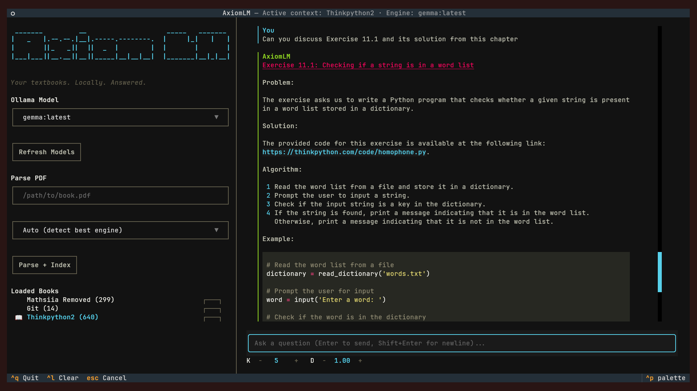
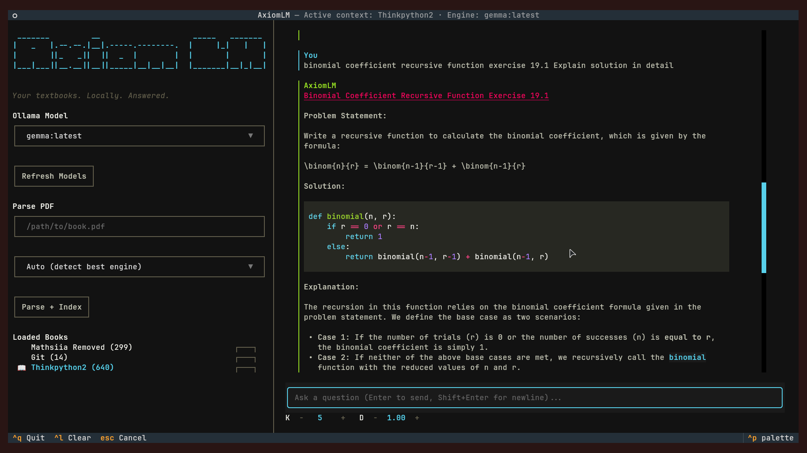
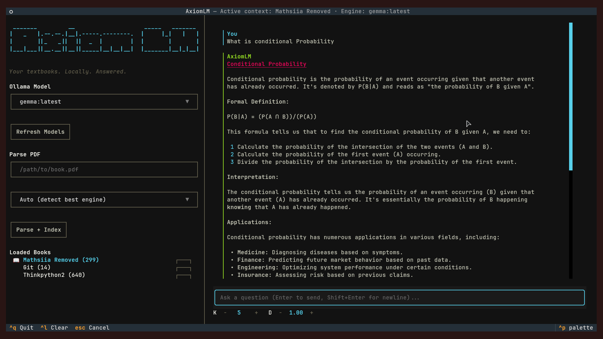

<div align="center">


### Your Textbooks. Locally. Answered.

**A fully local, privacy-first RAG study assistant that lives in your terminal.**  
Turn dense engineering mathematics and CS textbooks into cited, instant answers. 100% offline. Zero cloud dependencies. No GPU lockups.


</div>

---

## Table of Contents

- [What is AxiomLM?](#what-is-axiomlm)
- [Screenshots](#screenshots)
- [Features](#features)
- [Models Used](#models-used)
- [Tech Stack](#tech-stack)
- [Project Structure](#project-structure)
- [Installation](#installation)
- [Documentation](#documentation)
  - [Parsing PDFs](#parsing-pdfs)
  - [Smart Routing Heuristics (Clean vs Scanned)](#smart-routing-heuristics-clean-vs-scanned)
  - [How the Engines Work](#how-the-engines-work)
  - [Tuning K and D Values](#tuning-k-and-d-values)
  - [Why Scanned PDFs Take Longer](#why-scanned-pdfs-take-longer)
- [Roadmap](#roadmap)
- [Contributing](#contributing)
- [License](#license)

---

## What is AxiomLM?

Studying dense engineering mathematics and computer science textbooks with cloud AI is broken—full books exceed reliable reasoning limits, cloud uploads compromise privacy, and complex mathematical formulas get distorted.

**AxiomLM is a fully local, privacy-first RAG study assistant that lives in your terminal.** Point it at your textbooks, lecture notes, or past papers—clean or scanned—and get instant, grounded answers with exact book, chapter, and page citations. Everything runs 100% offline on your own machine.

---

## Screenshots




---

## Features

**Core**
- Fully local RAG pipeline — no data ever leaves your machine
- Smart PDF routing — automatically detects clean vs scanned PDFs and picks the right parser without GPU lockup
- Conversation memory — follow-up questions like "give me an example of this" work correctly
- Cited answers — every response shows the source book, chapter, and page number
- Multi-book support — index multiple books and switch between them in the same session
- Checkpoint/resume system — long parses resume from where they left off if interrupted
- GPU acceleration — uses your NVIDIA GPU for faster parsing when available

**Interface**
- Terminal-native TUI built with Textual
- ASCII logo with cyan color scheme
- Live parsing progress with ETA and chunk stats
- Token speed and response time displayed per answer
- Copy and Code buttons on every response
- Keyboard-driven — `^q` quit, `^l` clear, `^d` delete book

**Parsing Engines**
- `pymupdf4llm` — instant direct parsing for clean digital PDFs (<10s for 200+ pages)
- `MinerU` — GPU-accelerated OCR for scanned and complex PDFs, with batched processing to prevent VRAM exhaustion
- `Marker` — manual option for clean math-heavy PDFs (requires 8GB+ VRAM)

---

## Models Used

| Role | Model | Purpose |
|---|---|---|
| **LLM** | Ollama (default: `qwen3:4b`) | Dense reasoning, LaTeX formula comprehension, and strict citation formatting |
| **Embeddings** | `jinaai/jina-embeddings-v5-text-nano` | Asymmetric semantic retrieval (`Document: ` / `Query: `) |
| **OCR (scanned PDFs)** | MinerU `hybrid-auto-engine` | Extracting text and formulas from photographed/scanned pages |

AxiomLM defaults to `qwen3:4b` for superior mathematical reasoning, code comprehension, and strict instruction-following within a lightweight (~2.5–3.0 GB VRAM) footprint. You can also switch to Qwen 2.5 Coder, DeepSeek, or any other Ollama model from the dropdown.

---

## Tech Stack

| Layer | Technology |
|---|---|
| **TUI Framework** | Textual |
| **LLM Runtime** | Ollama (`qwen3:4b`) |
| **Vector Database** | ChromaDB (persistent, local) |
| **Embeddings** | Sentence Transformers + Jina v5 Nano |
| **PDF Parsing (clean)** | pymupdf4llm |
| **PDF Parsing (scanned)** | MinerU |
| **PDF Parsing (math)** | Marker (manual, GPU-heavy) |
| **GPU Acceleration** | PyTorch + CUDA |
| **Language** | Python 3.11+ |

---

## Project Structure

```
AxiomLM/
├── src/
│   ├── tui.py           # Main TUI application — all UI logic, RAG pipeline, chat handler
│   ├── ocr.py           # Unified OCR entry point — smart auto-routing heuristic
│   ├── ocr_marker.py    # Marker runner for clean math PDFs
│   ├── ocr_mineru.py    # MinerU runner for scanned PDFs — batched, resumable
│   ├── ocr_pymupdf4llm.py # pymupdf4llm runner for clean digital PDFs
│   ├── indexer.py       # Header-aware chunking and indexing into ChromaDB
│   ├── db.py            # ChromaDB client, Jina v5 embeddings, collection management
│   ├── checkpoint.py    # Per-page checkpoint system for resumable parsing
│   ├── preprocessor.py  # Text cleaning and normalization before indexing
│   ├── config.py        # Single source of truth: configuration constants & thresholds
│   └── __init__.py
├── scripts/             # Setup and validation scripts
├── data/                # Local data directory (gitignored)
│   ├── parsed_md/       # Per-book parsed markdown files
│   ├── checkpoints/     # Per-page parsing checkpoints
│   └── vector_store/    # ChromaDB persistent storage
├── pyproject.toml       # Package definition and entry point
├── requirements.txt     # Python dependencies
├── install.sh           # Deterministic one-command installer
├── PRD.md               # Product Requirements Document
├── ARCHITECTURE.md      # System Architecture Specification
├── memory.md            # Persistent Project Memory & Decision Log
└── README.md
```

---

## Installation

### Requirements

- Linux (tested on Arch Linux, Ubuntu, Fedora)
- Python 3.11+
- [Ollama](https://ollama.ai) installed and running
- NVIDIA GPU recommended (e.g. RTX 3050 6GB or better for scanned PDF OCR)

### One-Command Install

```bash
curl -sSL https://raw.githubusercontent.com/JustJoyful/AxiomLM/main/install.sh | bash
```

**What this script does step-by-step:**
1. **Checks Dependencies:** Verifies Python 3.11+ and checks for a running `ollama` instance.
2. **Creates Isolated Virtual Environment:** Generates `.venv/` using `python3 -m venv` and upgrades `pip`.
3. **Installs Stable PyTorch Wheel:** Uninstalls conflicting system/CUDA libraries and installs CPU-optimized PyTorch (`torch torchvision --index-url https://download.pytorch.org/whl/cpu`) as a fail-safe against CUDA NCCL symbol collisions.
4. **Installs Python Dependencies:** Installs all core packages from `requirements.txt`.
5. **Installs AxiomLM in Dev Mode:** Executes `pip install -e ".[dev]"` so the CLI is immediately editable.
6. **Creates PATH Launcher:** Generates an executable wrapper script at `~/.local/bin/axiomlm` that activates `.venv` and passes all arguments.

### Manual Install

```bash
git clone https://github.com/JustJoyful/AxiomLM.git
cd AxiomLM
bash install.sh
```

### Pull a Model

AxiomLM defaults to `qwen3:4b`. Pull it through Ollama:

```bash
ollama pull qwen3:4b
# or for code-centric study:
ollama pull qwen2.5-coder:7b
```

### Run

```bash
axiomlm
```

---

## Documentation

### Parsing PDFs

To use AxiomLM, enter the full path to your PDF in the **Parse PDF** input and click **Parse + Index**.

The app automatically detects whether the book is a clean digital PDF or a physical scan and routes it to the optimal parser. You can also manually pick an engine from the dropdown if you want to override auto-detection.

Once parsing completes, the book appears in the **Loaded Books** panel with a chunk count. Click it and start querying.

---

### Smart Routing Heuristics (Clean vs Scanned)

AxiomLM avoids the "black box" trap of sending clean documents to heavy OCR models.

#### How the decision is made:
1. **Uniform Sampling:** When mode is set to `auto`, `src/ocr.py` samples 8 pages spaced evenly throughout the entire document (e.g., pages 0, 71, 142, 213, 284, 355, 426, 499 for a 500-page book).
2. **Metric Inspection:** Each sampled page is inspected via PyMuPDF for text character density ($T$) and image area coverage ($C$).
3. **Scan-Like Classification:** A sampled page is counted as scan-like if:
   - $(T \le 180 \text{ chars} \land C \ge 0.45)$, or
   - $(T \le 60 \text{ chars} \land \text{has\_image\_block})$, or
   - $(C \ge 0.90 \land \text{has\_image\_block})$ (catches full-page scans with hidden OCR text).
4. **Majority Threshold:** The book is sent to MinerU **only if $\ge 50\%$ of the sampled pages** are classified as scan-like. Otherwise, it routes to `pymupdf4llm`.

#### The "Page 4 Diagram" Case
What happens if a 500-page clean digital PDF happens to have one scanned diagram on page 4?
- Out of the 8 evenly sampled pages across the 500 pages, at most 1 page (or 0) will have an image.
- The scan ratio evaluates to $\le 12.5\%$, far below the $50\%$ threshold.
- **Result:** The document is safely routed to `pymupdf4llm`, finishing in under 10 seconds without locking your GPU for 40 minutes.

#### Preview & Overrides
You always have manual control before committing your hardware:
- **CLI Override:** `python -m src.ocr --mode pymupdf4llm /path/to/book.pdf`
- **TUI Override:** Select `pymupdf4llm`, `mineru`, or `marker` from the **Engine** dropdown before clicking **Parse + Index**.

---

### How the Engines Work

AxiomLM uses three specialized parsing engines:

**pymupdf4llm — Clean Digital PDFs (Default for digital books)**
Directly extracts text, tables, and formatting from PDF structures without OCR. For a 240-page textbook like *Think Python*, parsing finishes in under 10 seconds on CPU. Zero GPU VRAM used.

**MinerU — Scanned and Complex PDFs**
Used for physical books photographed or scanned page by page where text is embedded as bitmap pixels. Runs region detection, table recognition, and formula recognition (UnimerNet). Operates in GPU batches of 24 pages with VRAM flushing to prevent OOM errors on 6GB GPUs. Checkpoints each page (`page_NNNN.md`) so interrupted parses resume without recomputing.

**Marker — Clean Math-Heavy PDFs (Manual)**
Manual alternative for clean PDFs containing dense mathematical notation that standard text extractors might flatten. Requires 8GB+ VRAM; select manually from the dropdown when hardware permits.

---

### Tuning K and D Values

At the bottom of the chat panel:

```
K - 5 + D - 0.75 +
```

- **K (Top Chunks):** Number of chunks retrieved from ChromaDB (default: 5). Higher values (8–10) provide broader context for wide conceptual questions like *"explain Green's theorem and its relation to Stokes' theorem."* Lower values (3–5) keep answers focused and fast.
- **D (Distance Threshold):** Cosine distance cutoff (default: 0.75). Lower values are stricter, returning only high-similarity chunks. Higher values cast a wider net when seeking loosely phrased concepts.

---

### Why Scanned PDFs Take Longer

Scanned physical books contain images, not text characters. MinerU executes a full computer vision pipeline: region detection, layout analysis, optical character recognition, and math formula transcription.

To run reliably on consumer GPUs like an RTX 3050 (6GB VRAM), MinerU processes in batches of 24 pages, flushes VRAM between batches, and commits page checkpoints to disk. Expect 5–10 minutes for a 100-page scanned document, and 30–40 minutes for a dense 500-page engineering textbook.

---

## Roadmap

### Study & Comprehension Tools
- **Flashcard Export (Anki):** Automatically export key theorems, definitions, and code syntax into `.apkg` and TSV decks with full LaTeX math equation preservation (`$...$`).
- **Knowledge Gap Tracker:** Diagnostic study mode that evaluates user question history against textbook chapter outlines to identify unmastered concepts and missing prerequisites.

### UI Improvements
- Fix ASCII logo rendering across different terminal font line-heights
- Denser sidebar layout with Unicode glyphs (requires Nerd Fonts)
- Subtle background pattern in the empty chat panel
- Enhanced LaTeX-to-Unicode post-processing for cleaner terminal math rendering
- Remove horizontal scrollbar from code blocks

### Quality of Life
- `@book` mention syntax to query a specific book without switching context
- `/commands` for in-chat actions like `/clear`, `/books`, `/reindex`
- Session export — save study conversations as Markdown
- Automatic model warm-up on launch to eliminate first-token cold start
- Per-book conversation history that persists across sessions

---

## Contributing

AxiomLM is actively developed. Contributions are welcome.

```bash
# Fork and clone
git clone https://github.com/YOUR_USERNAME/AxiomLM.git
cd AxiomLM

# Install in dev mode
bash install.sh

# Make your changes and check formatting
.venv/bin/black src/
.venv/bin/ruff check src/
```

---

## License

MIT — free to use, fork, and adapt.

---

<div align="center">

Built by a student, for students.  
**Your Textbooks. Locally. Answered.**

</div>
